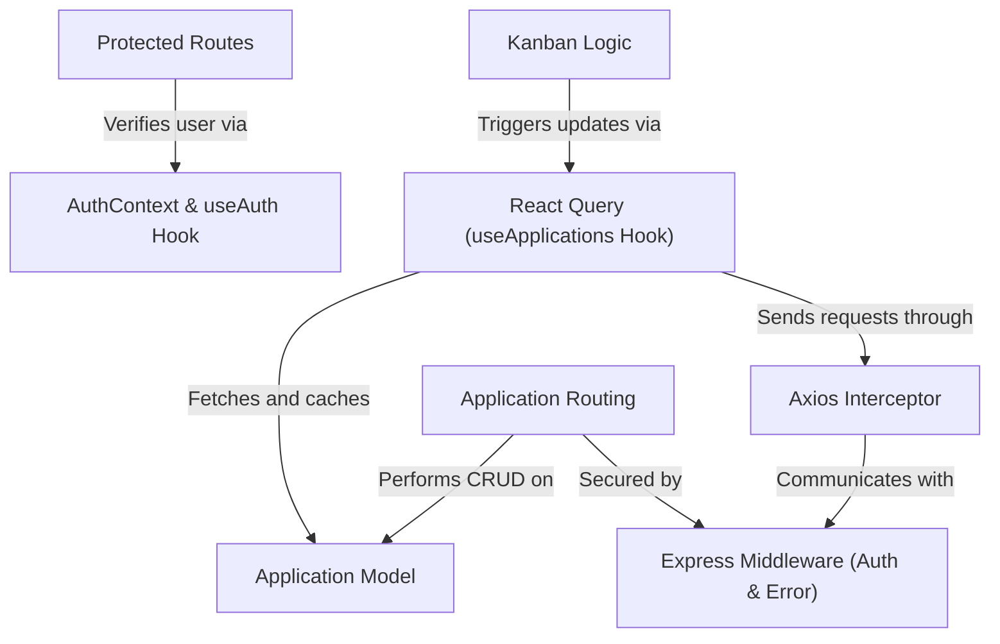
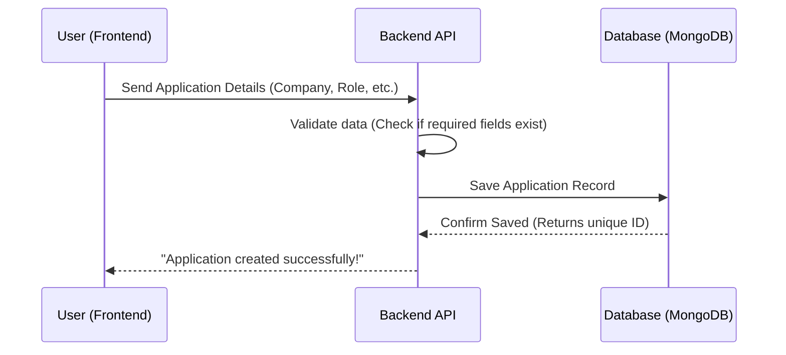
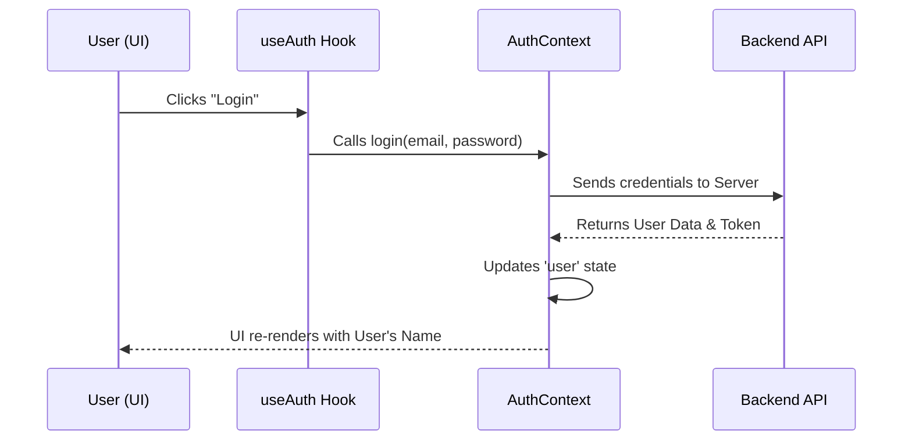
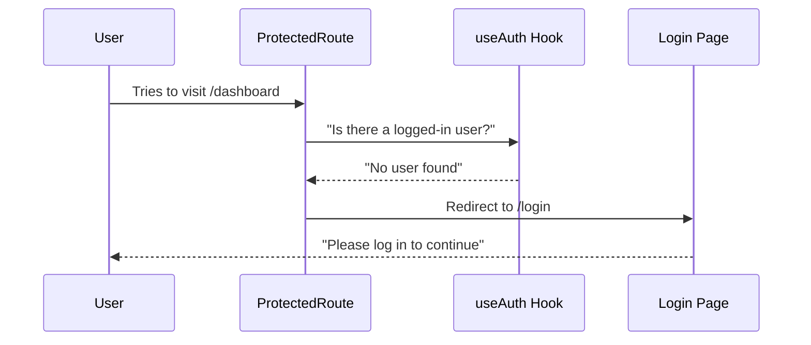
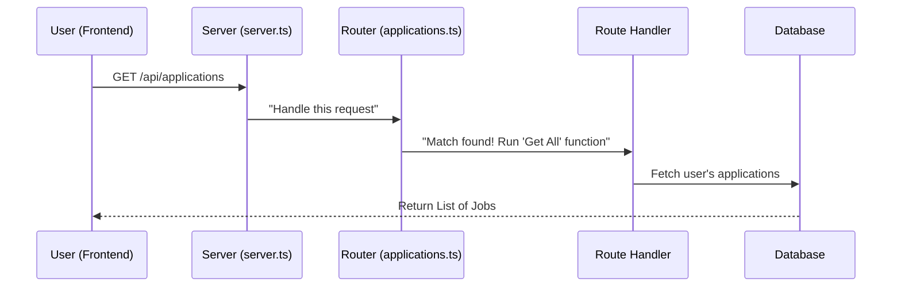
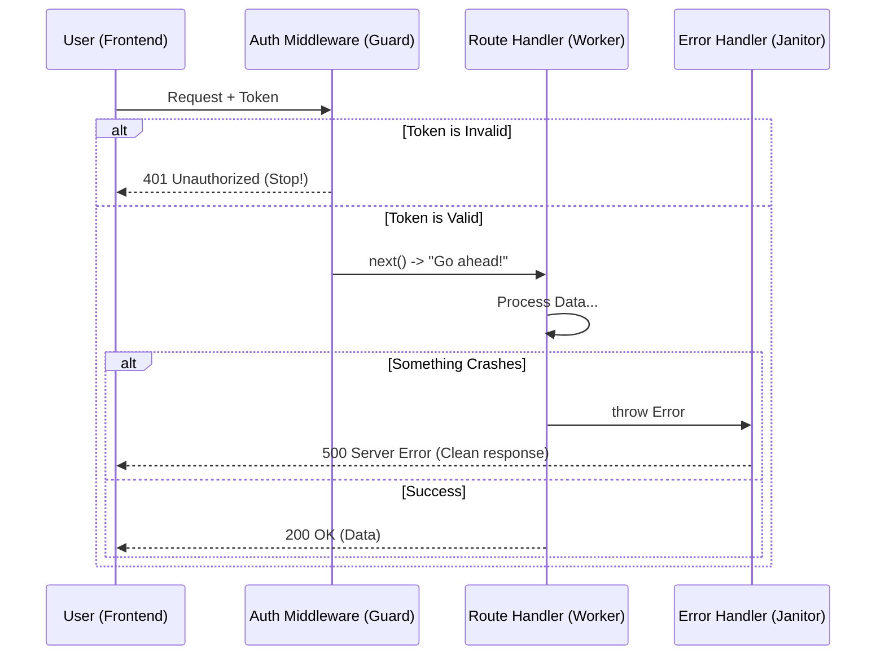
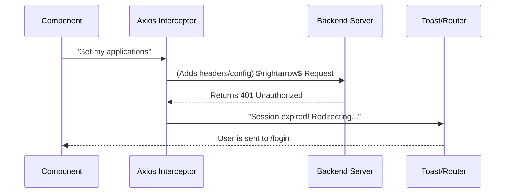
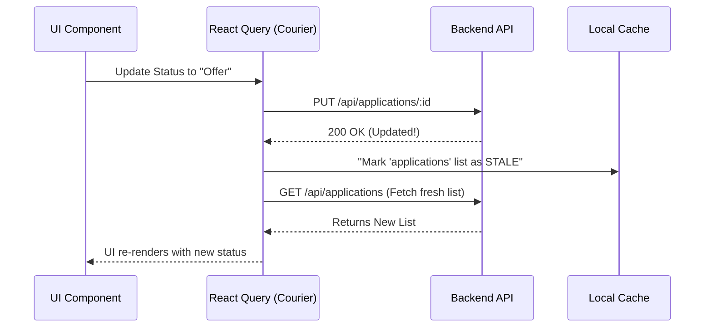
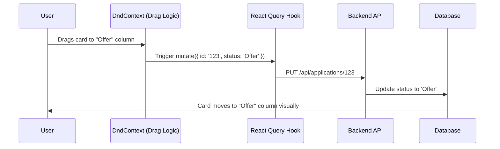

# Tutorial: job-application-tracker

The **Job Application Tracker** is a full-stack application designed to help job seekers *organize and monitor* their employment search. It allows users to track various job opportunities through a **Kanban-style workflow**, manage recruiter contacts, and maintain a detailed history of *interactions and status changes* for every application.


**Source Repository:** [https://github.com/Yashraj-sherke/job-application-tracker](https://github.com/Yashraj-sherke/job-application-tracker)



## Chapters

1. [Application Model
](01_application_model_.md)
2. [AuthContext & useAuth Hook
](02_authcontext___useauth_hook_.md)
3. [Protected Routes
](03_protected_routes_.md)
4. [Application Routing
](04_application_routing_.md)
5. [Express Middleware (Auth & Error)
](05_express_middleware__auth___error__.md)
6. [Axios Interceptor
](06_axios_interceptor_.md)
7. [React Query (useApplications Hook)
](07_react_query__useapplications_hook__.md)
8. [Kanban Logic
](08_kanban_logic_.md)


---

Generated by [AI Codebase Knowledge Builder](https://github.com/The-Pocket/Tutorial-Codebase-Knowledge)


---


# Chapter 1: Application Model

Imagine you are applying for 20 different jobs. You have some emails from recruiters, a few calendar invites for interviews, and a messy spreadsheet trying to keep track of who you've heard back from. 

**The Problem:** It's easy to forget which resume version you sent to "Company A" or when you should follow up with "Recruiter B."

**The Solution:** The **Application Model**. Think of this as a digital "Job Application Folder." Instead of scattered notes, every single detail about one specific job opportunity is stored in one organized place.

---

## Breaking Down the "Folder"

To make this digital folder work, we need to define exactly what goes inside it. We can break the Application Model into three main parts:

### 1. Basic Info (The Cover Page)
These are the static details you enter when you first apply.
- **Company & Role:** Who are they and what is the job? (e.g., "Google", "Frontend Developer").
- **Logistics:** Where is the job? Is it remote? How much does it pay?
- **Source:** Did you find it on LinkedIn, or did a friend refer you?

### 2. Tracking (The Status Tracker)
This tracks where you are in the hiring process.
- **Current Status:** Are you in the `Backlog`, `Technical Round`, or did you get an `Offer`?
- **History:** A log of every time the status changed (e.g., "Moved from Applied $\rightarrow$ HR Screen on Oct 10th").

### 3. Interactions (The Communication Log)
A list of every touchpoint you've had with the company.
- **Type:** Was it a phone call, an email, or a formal interview?
- **Notes:** "The recruiter mentioned they use React and Tailwind."

---

## How it Works in Practice

Let's say you just applied for a role at **TechCorp**. Here is how the model handles that data.

**Input (What you provide):**
- Company: `TechCorp`
- Role: `Junior Developer`
- Portal: `LinkedIn`
- Status: `Applied`

**Result (What the model stores):**
The system creates a record that looks like this:
```typescript
{
  companyName: "TechCorp",
  jobTitle: "Junior Developer",
  status: "Applied",
  statusHistory: [{ status: "Applied", changedAt: "2023-10-01" }],
  interactions: [] 
}
```
*Now, whenever you get an email from TechCorp, you simply add a new "Interaction" to this specific folder!*

---

## Under the Hood: The Implementation

The Application Model is defined in two places: the **Backend** (where the data is saved in a database) and the **Frontend** (where the data is displayed on your screen).

### The Backend Logic (Mongoose)
We use Mongoose to tell the database exactly what an application should look like.

**Defining the Interaction:**
```typescript
const interactionSchema = new Schema({
    type: { type: String, enum: ['call', 'email', 'interview', 'other'] },
    date: { type: Date, required: true },
    notes: { type: String, required: true },
});
```
*This ensures you can't add an interaction without a date and a note.*

**Defining the Main Application:**
```typescript
const applicationSchema = new Schema({
    companyName: { type: String, required: true },
    status: { 
        type: String, 
        enum: ['Backlog', 'Applied', 'HR Screen', 'Offer', 'Rejected'],
        default: 'Backlog' 
    },
    // ... other fields
});
```
*The `enum` acts like a dropdown menu—it prevents you from entering a status that doesn't exist.*

### The Frontend Logic (TypeScript)
On the frontend, we use an `interface`. This is like a "contract" that tells the React app exactly what properties an application object has so the code doesn't crash.

```typescript
export interface Application {
    _id: string;
    companyName: string;
    jobTitle: string;
    status: 'Backlog' | 'Applied' | 'Offer' | 'Rejected';
    // ... other fields
}
```
*This helps the developer see a list of suggestions (autocomplete) while coding.*

---

## Data Flow Sequence

Here is what happens when you create a new application:



## Summary & Next Steps

In this chapter, we learned that the **Application Model** is the heart of the project. It organizes all your job-hunting chaos into a structured format consisting of basic info, status history, and interaction logs.

Now that we know *what* data we are tracking, we need to make sure that only *you* can see your own applications. To do that, we need a way to handle users and authentication.

Next up: [AuthContext & useAuth Hook](02_authcontext___useauth_hook_.md)

---

Generated by [AI Codebase Knowledge Builder](https://github.com/The-Pocket/Tutorial-Codebase-Knowledge)


---


# Chapter 2: AuthContext & useAuth Hook

In [Application Model](01_application_model_.md), we defined how to store job application data. But there is a big problem: if anyone can access the app, everyone would see everyone else's job applications! 

We need a way to identify who is using the app and ensure that "User A" only sees "User A's" data.

## The Problem: The "Prop Drilling" Nightmare

Imagine your app is like a large building. Every room (Component) needs to know if the person inside is logged in. 

Without a central system, you would have to pass the `user` information from the front door, through the hallway, into the living room, and then into the kitchen. In React, this is called **Prop Drilling**, and it makes your code messy and hard to maintain.

**The Solution:** The **AuthContext**. Think of it as a **Security Badge System**. Instead of passing a badge from person to person, the building has a central "Security Desk" (the Context). Any room in the building can simply ask the desk, *"Who is the current user?"* and get an immediate answer.

---

## Key Concepts

### 1. AuthContext (The Security Desk)
`AuthContext` is a global storage area. It holds the current user's information and the functions needed to change that state (like logging in or logging out). It wraps around your entire application so that every single component has access to this data.

### 2. AuthProvider (The Manager)
The `AuthProvider` is the component that actually *manages* the state. It handles the logic of talking to the backend API to verify the user and then "broadcasts" that information to the rest of the app.

### 3. useAuth Hook (The Request Form)
The `useAuth` hook is a shortcut. Instead of writing complex code to access the context, you just call `useAuth()`, and it gives you exactly what you need: the `user` and the `login/logout` functions.

---

## How to use it in your components

Let's say you want to show a "Welcome" message if the user is logged in, or a "Login" button if they aren't.

**The Implementation:**
```typescript
const { user, login } = useAuth();

if (!user) {
  return <button onClick={() => login('email@test.com', 'password')}>Login</button>;
}

return <h1>Welcome back, {user.name}!</h1>;
```

**What happens here?**
1. `useAuth()` asks the "Security Desk" for the current state.
2. If `user` is `null`, the app shows the Login button.
3. Once `login()` is called, the `AuthContext` updates, and the screen automatically changes to show the Welcome message.

---

## Under the Hood: How it Works

When a user tries to log in, a specific sequence of events happens to ensure they are verified.



### The Internal Implementation

#### 1. Creating the Context
First, we create the context. This defines what "tools" are available to the rest of the app.

```typescript
// frontend/src/context/AuthContext.tsx
interface AuthContextType {
    user: User | null;
    login: (email: string, password: string) => Promise<void>;
    logout: () => Promise<void>;
}
export const AuthContext = createContext<AuthContextType | undefined>(undefined);
```
*This tells TypeScript: "Our security desk will provide the user's info and ways to log in/out."*

#### 2. Providing the State
The `AuthProvider` uses a `useState` hook to remember the user and a `useMemo` hook to make sure the app doesn't slow down by re-rendering too often.

```typescript
// frontend/src/context/AuthContext.tsx
export const AuthProvider = ({ children }) => {
    const [user, setUser] = useState(null);

    const login = async (email, password) => {
        const userData = await authApi.login(email, password);
        setUser(userData); // Update the "badge"
    };

    return (
        <AuthContext.Provider value={{ user, login }}>
            {children}
        </AuthContext.Provider>
    );
};
```
*The `value` prop is what actually "broadcasts" the data to all the `children` components.*

#### 3. The Shortcut Hook
To make using the context easy, we create a custom hook.

```typescript
// frontend/src/hooks/useAuth.ts
export const useAuth = () => {
    const context = useContext(AuthContext);
    if (!context) throw new Error('useAuth must be used within AuthProvider');
    return context;
};
```
*This prevents the app from crashing by ensuring you don't try to ask for a user if the "Security Desk" (AuthProvider) isn't set up.*

---

## Summary & Next Steps

We've built the **Identity Manager** of our application. Now, any component can instantly know if a user is authenticated without passing data through ten different layers of components.

But knowing *who* the user is isn't enough. We also need to stop unauthenticated users from visiting certain pages (like the Job Dashboard). 

Next up: [Protected Routes](03_protected_routes_.md), where we will use our `useAuth` hook to lock the doors to unauthorized users!

---

Generated by [AI Codebase Knowledge Builder](https://github.com/The-Pocket/Tutorial-Codebase-Knowledge)


---


# Chapter 3: Protected Routes

In [AuthContext & useAuth Hook](02_authcontext___useauth_hook_.md), we built a "Security Desk" that knows exactly who is logged in. But knowing who the user is doesn't automatically stop them from visiting pages they shouldn't see.

Imagine if a stranger could simply type `/dashboard` into their browser's address bar and see your private job applications just because they knew the URL. That would be a huge security flaw!

## The Problem: The "Open Door" Policy

By default, every page (route) in a React app is like an open door. Anyone who knows the address can walk right in. For a job tracker, this is dangerous. You only want users who have a valid "Security Badge" (an authenticated session) to enter the Dashboard or the Kanban board.

**The Solution:** The **Protected Route**. Think of this as a **VIP Access Wrapper**. Instead of adding a security check to every single page manually, we create one "Locked Door" component. If you have the key, you get in; if not, you are immediately redirected to the login screen.

---

## How it Works: The VIP Wrapper

Instead of putting the security logic inside your `DashboardPage` or `KanbanPage`, we wrap those pages inside a `ProtectedRoute` component.

### The "Locked Door" Logic
The logic is very simple:
1. **Is the app still checking the user's status?** $\rightarrow$ Show a loading spinner.
2. **Is the user logged in?** $\rightarrow$ Let them through to the page.
3. **Is the user a stranger?** $\rightarrow$ Kick them back to the `/login` page.

### Using it in your App
Here is how we wrap a page to protect it:

```typescript
<ProtectedRoute>
    <DashboardPage />
</ProtectedRoute>
```
**What happens here?**
- If you are logged in, you see the `DashboardPage`.
- If you aren't, you never even see the dashboard; you are instantly sent to the login page.

---

## Under the Hood: The Implementation

Let's look at how the `ProtectedRoute` component actually makes these decisions.

### The Step-by-Step Flow



### The Code Breakdown

The `ProtectedRoute` component acts as a gatekeeper. It uses the `useAuth` hook we created in the previous chapter to check the user's status.

**1. Handling the "Loading" State**
We can't decide to kick a user out while the app is still checking if they are logged in (which takes a few milliseconds).

```typescript
if (loading) {
    return <div className="spinner">Loading...</div>;
}
```
*This prevents the app from accidentally redirecting a logged-in user to the login page while the "Security Desk" is still verifying their badge.*

**2. The Redirect (The "Kick Out")**
If the `user` is `null`, we use the `Navigate` component from `react-router-dom` to send them away.

```typescript
if (!user) {
    return <Navigate to="/login" replace />;
}
```
*The `replace` prop ensures the user can't click the "Back" button to try and sneak back into the protected page.*

**3. The Green Light**
If the user is authenticated, we render the `children`. In React, `children` refers to whatever component was wrapped inside the `ProtectedRoute`.

```typescript
return <>{children}</>;
```
*This is the "Open Sesame!" moment where the user is finally allowed to see the private content.*

---

## Putting it All Together

In your `App.tsx`, you can protect entire groups of pages at once by wrapping a layout. This means you don't have to wrap every single single page individually.

```typescript
<Route
    path="/"
    element={
        <ProtectedRoute>
            <Layout />
        </ProtectedRoute>
    }
>
    <Route path="dashboard" element={<DashboardPage />} />
    <Route path="kanban" element={<KanbanPage />} />
</Route>
```
*Because the `Layout` is protected, every page inside it (Dashboard, Kanban, etc.) is now automatically locked!*

## Summary & Next Steps

We've now implemented a **Security Gate**. By using the `ProtectedRoute` wrapper, we ensure that private data is only visible to authenticated users, keeping your job search data safe.

We have the identity manager ([AuthContext & useAuth Hook](02_authcontext___useauth_hook_.md)) and the security gate ([Protected Routes](03_protected_routes_.md)). Now, we need to organize all these doors into a proper map.

Next up: [Application Routing](04_application_routing_.md), where we will define the full map of our application's URLs!

---

Generated by [AI Codebase Knowledge Builder](https://github.com/The-Pocket/Tutorial-Codebase-Knowledge)


---


# Chapter 4: Application Routing

In [Protected Routes](03_protected_routes_.md), we built a "Security Gate" to make sure only logged-in users can access certain pages. But once a user is inside, how does the backend know exactly what they want? 

If a user clicks "Delete Application," the server needs to know: *"Do they want to delete everything, or just one specific application? Which one?"*

## The Problem: The "Confused Server"

Imagine you call a large company's customer support. If you just say "I need help!" and hang up, the operator won't know where to send you. You need a **phone menu**:
- "Press 1 for Billing"
- "Press 2 for Technical Support"
- "Press 3 to speak to an agent"

**Application Routing** is that phone menu for your backend. It takes an incoming request from the frontend and routes it to the correct piece of logic. Without routing, the server is just a blank slate that doesn't know how to respond to different requests.

---

## Key Concepts: The Routing Map

In our Job Application Tracker, routing is handled by **Express**. It maps a **URL (the path)** and an **HTTP Method (the action)** to a specific function.

### 1. The HTTP Method (The "Action")
Think of the method as the "verb" of the request:
- `GET`: "Please **give** me some data." (Read)
- `POST`: "Please **create** something new." (Create)
- `PUT`: "Please **update** this existing thing." (Update)
- `DELETE`: "Please **remove** this thing." (Delete)

### 2. The Endpoint (The "Address")
The endpoint is the URL path. For example, `/api/applications` is the address where all job-related requests go.

### 3. The Route Handler (The "Worker")
This is the actual function that does the work—like searching the database or saving a new job application.

---

## Solving the Use Case: Creating a Job Application

Let's see how this works when you add a new job to your tracker.

**The Request (Frontend $\rightarrow$ Backend):**
- **Method:** `POST`
- **Path:** `/api/applications`
- **Data:** `{ "companyName": "Google", "jobTitle": "Developer" }`

**The Route Logic:**
The server sees `POST` + `/api/applications` and says: *"Aha! This user wants to create a new application. I will trigger the 'Create' function."*

**The Result:**
The server saves the data to the database and sends back a `201 Created` status.

---

## Under the Hood: How it Works

When a request hits your server, it follows a specific path before it ever reaches the database.



### The Implementation Breakdown

The routing is split into two files to keep things organized.

#### 1. The Main Entry Point (`server.ts`)
The main server file acts as the "Main Switchboard." It doesn't handle the details; it just delegates the work to specific route files.

```typescript
// backend/src/server.ts
import applicationRoutes from './routes/applications';

// All requests starting with /api/applications 
// are sent to the applicationRoutes file
app.use('/api/applications', applicationRoutes);
```
*This keeps the main file clean. Instead of 100 routes in one file, we group them by feature.*

#### 2. The Feature Router (`applications.ts`)
This is where the specific "phone menu" options are defined.

**Fetching all applications:**
```typescript
// GET /api/applications
router.get('/', async (req, res) => {
    const applications = await Application.find({ userId: req.user._id });
    res.json({ success: true, data: applications });
});
```
*When the user visits the main dashboard, this route fetches only their specific jobs.*

**Updating a specific application:**
```typescript
// PUT /api/applications/:id
router.put('/:id', async (req, res) => {
    const application = await Application.findByIdAndUpdate(req.params.id, req.body);
    res.json({ success: true, data: application });
});
```
*The `:id` is a **URL Parameter**. It's a placeholder that allows the server to know exactly which application to update (e.g., `/api/applications/123`).*

**Deleting an application:**
```typescript
// DELETE /api/applications/:id
router.delete('/:id', async (req, res) => {
    await Application.findOneAndDelete({ _id: req.params.id });
    res.json({ success: true, message: 'Deleted!' });
});
```
*Simple and direct: find the ID and remove it from the database.*

---

## Summary & Next Steps

We've built the **Traffic Controller** of our backend. Now, the server knows exactly how to handle creating, reading, updating, and deleting applications based on the URL and the HTTP method used.

However, there is a problem: right now, any request that hits these routes is processed immediately. But what if the user isn't logged in? Or what if they send empty data? We need a way to "filter" requests before they reach the handler.

Next up: [Express Middleware (Auth & Error)](05_express_middleware__auth___error_.md), where we will learn how to add security checks and error handling to our routes!

---

Generated by [AI Codebase Knowledge Builder](https://github.com/The-Pocket/Tutorial-Codebase-Knowledge)


---


# Chapter 5: Express Middleware (Auth & Error)

In [Application Routing](04_application_routing_.md), we set up the "phone menu" for our backend, allowing the server to route requests to the right functions. But there is a problem: right now, our routes are too trusting. 

If a user sends a request to `/api/applications`, the server just does it. It doesn't check if the user is actually logged in, and if the server crashes due to a bug, it might send back a giant, scary wall of technical text (a stack trace) that confuses the user and reveals secrets about our code.

## The Problem: The "Open Door" and the "Messy Crash"

Imagine your backend is like a private office building. 

1. **The Open Door:** Right now, anyone can walk into the "Application Records" room without showing an ID. We need a **Security Guard** who stands at the door and says, *"Stop! Show me your ID badge before you enter."*
2. **The Messy Crash:** If a light fixture falls from the ceiling (a server error), the office just stays messy and chaotic. We need a **Clean-up Crew** (a janitor) who quickly cleans up the mess and tells the visitor, *"Sorry, something went wrong, but we're fixing it!"* in a polite way.

**The Solution:** **Express Middleware**. Middleware are functions that run *after* the request is received but *before* it reaches the final route handler.

---

## Key Concept 1: The Auth Middleware (The Security Guard)

The `protect` middleware is our security guard. Its only job is to check if the request contains a valid "ID badge" (a JWT token).

### How it works in practice:
When a user tries to fetch their jobs, the request goes through the `protect` middleware first.

**Scenario A: No Token**
- **Input:** Request to `/api/applications` with no token.
- **Result:** The guard stops the request immediately and sends back: `401 Unauthorized`. The route handler is never even called.

**Scenario B: Valid Token**
- **Input:** Request with a valid token.
- **Result:** The guard says, *"You're good to go!"* and calls `next()`, which lets the request move forward to the route handler.

### Using the Guard in a Route
We simply plug the `protect` function into the route definition:

```typescript
// Only logged-in users can reach this route
router.get('/', protect, async (req, res) => {
    // This code only runs if 'protect' called next()
    const apps = await Application.find({ userId: req.user._id });
    res.json(apps);
});
```
*By adding `protect` before the `async` function, we've locked the door!*

---

## Key Concept 2: The Error Handler (The Clean-up Crew)

Normally, when a server crashes, it sends a messy error message. The **Error Middleware** is a special function that catches every single error that happens anywhere in the app and formats it into a clean, readable response.

### How it works in practice:
If a database query fails or a piece of code crashes:
1. The error is "thrown" (like a signal for help).
2. Express skips all regular routes and jumps straight to the **Error Handler**.
3. The handler sends a polite response: `{ "success": false, "message": "Server Error" }`.

---

## Under the Hood: The Request Flow

Here is the journey of a request when it hits our server.



---

## Internal Implementation

### 1. The Security Guard (`auth.ts`)
The `protect` middleware looks for a token in the cookies. If it finds one, it verifies it using a secret key.

```typescript
export const protect = async (req, res, next) => {
    const token = req.cookies.token;

    if (!token) {
        res.status(401).json({ message: 'Not authorized' });
        return; // Stop the request here!
    }

    // ... verify token logic ...
    next(); // "Everything is okay, move to the next function!"
};
```
*The `next()` function is the magic button that tells Express to move to the next middleware or the final route handler.*

### 2. The Clean-up Crew (`errorHandler.ts`)
The error handler is unique because it takes **four** arguments instead of three. This tells Express: *"I am the official error handler."*

```typescript
export const errorHandler = (err, req, res, next) => {
    const statusCode = err.statusCode || 500;
    const message = err.message || 'Server Error';

    res.status(statusCode).json({
        success: false,
        message,
    });
};
```
*Regardless of what went wrong, the user always gets a consistent JSON response instead of a crashing page.*

### 3. The "Not Found" Guard
Sometimes users try to visit a URL that doesn't exist (e.g., `/api/something-random`). We use a `notFound` middleware at the very end of our server file to handle this.

```typescript
export const notFound = (req, res, next) => {
    res.status(404).json({
        message: `Route ${req.originalUrl} not found`,
    });
};
```

---

## Summary & Next Steps

We have now secured our backend! We added a **Security Guard** (`protect`) to ensure only authenticated users can access their data, and a **Clean-up Crew** (`errorHandler`) to ensure our app fails gracefully without leaking technical details.

Now that our backend is secure and stable, we need a way for our frontend to communicate with it efficiently. Currently, we have to manually attach tokens or handle errors in every single API call.

Next up: [Axios Interceptor](06_axios_interceptor_.md), where we will create a "Smart Messenger" that automatically handles tokens and errors for every single request!

---

Generated by [AI Codebase Knowledge Builder](https://github.com/The-Pocket/Tutorial-Codebase-Knowledge)


---


# Chapter 6: Axios Interceptor

In [Express Middleware (Auth & Error)](05_express_middleware__auth___error_.md), we built a "Security Guard" on the backend to block unauthorized requests. But from the frontend's perspective, we still have a problem: every time we make an API call, we have to manually handle errors and check if the user was kicked out.

Imagine if every time you sent a letter, you had to manually write your return address, stamp it, and then wait by the mailbox to see if it was returned for a mistake. If you send 50 letters, you're doing the same boring work 50 times!

## The Problem: Repetitive Communication

When your React app talks to the backend, two things happen constantly:
1. **The Request:** We need to tell the server "I am User X" (usually via cookies or tokens).
2. **The Response:** The server might say "Success!" or "Error 401: You are not logged in!"

Without an interceptor, your code looks like this in every single component:
```typescript
try {
  const res = await axios.get('/api/applications');
} catch (err) {
  if (err.response.status === 401) {
    // Redirect to login...
  } else {
    // Show error toast...
  }
}
```
Writing this `try-catch` block in every single file is exhausting and makes your code messy.

**The Solution:** The **Axios Interceptor**. Think of it as a **Corporate Mailroom**. Instead of you handling every envelope, you just drop your letter on the mailroom desk. The mailroom staff automatically stamps every outgoing letter with the company seal and flags any returned mail that needs your attention.

---

## Key Concepts

### 1. The Request Interceptor (The Outgoing Stamp)
This is a function that runs *before* the request leaves your app. It can automatically add headers or authentication tokens so you don't have to do it manually in every component.

### 2. The Response Interceptor (The Incoming Filter)
This is a function that runs *after* the response arrives from the server, but *before* it reaches your `.then()` or `try-catch` block. It's the perfect place to handle global errors, like automatically redirecting a user to the login page if their session expires.

---

## How it Solves the Use Case

Let's see how the Interceptor handles a "Session Expired" scenario.

**The Scenario:** 
A user has been inactive for two hours. Their token has expired. They click "Refresh Applications."

**Without Interceptor:**
The request fails $\rightarrow$ The component catches the error $\rightarrow$ The component manually redirects the user to `/login`. (You have to write this logic in every page!).

**With Interceptor:**
The request fails $\rightarrow$ The **Interceptor** catches the `401 Unauthorized` error $\rightarrow$ The Interceptor triggers a global "Session expired" toast and redirects the user to `/login` automatically.

**The Result:**
Your component code stays clean. It only cares about the data; the Interceptor handles the "communication noise."

---

## Under the Hood: The Request Flow

Here is what happens when your app requests data from the server.



---

## Internal Implementation

We create a custom "instance" of Axios. This is like creating our own private postal service with its own set of rules.

### 1. Creating the Instance
First, we set up the basic configuration so we don't have to type the full URL every time.

```typescript
// frontend/src/api/axios.ts
const axiosInstance = axios.create({
    baseURL: API_URL,
    withCredentials: true, // Tells Axios to send cookies automatically
});
```
*`withCredentials: true` is the "magic switch" that allows the browser to send the authentication cookies we discussed in previous chapters.*

### 2. The Response Interceptor (The Filter)
We tell Axios: "Whenever a response comes back, run this function first."

```typescript
axiosInstance.interceptors.response.use(
    (response) => response, // If the response is successful, just let it pass through
    (error) => {
        // If there is an error, handle it here globally!
        handleGlobalError(error); 
        return Promise.reject(error);
    }
);
```
*The first function handles "Happy Paths" (200 OK), and the second function handles "Sad Paths" (400, 401, 500 errors).*

### 3. Handling the "Sad Paths"
Inside the error handler, we can check the status code to decide what to do.

```typescript
if (error.response.status === 401) {
    toast.error('Session expired. Please login again.');
    window.location.href = '/login';
} else {
    toast.error(error.response.data?.message || 'Something went wrong');
}
```
*Now, no matter which page the user is on, a `401` error will always trigger the same redirect and toast message.*

---

## Summary & Next Steps

The **Axios Interceptor** is your app's communication filter. It removes the need to write repetitive error handling in every component by centralizing the logic in one place. 

- **Request Interceptors** $\rightarrow$ Prepare the mail (Add tokens/headers).
- **Response Interceptors** $\rightarrow$ Filter the mail (Handle 401s/500s globally).

Now that we have a "Smart Messenger" to talk to our backend, we need a way to manage the data we receive. Fetching data manually with `useEffect` can lead to "loading" and "error" states being repeated everywhere.

Next up: [React Query (useApplications Hook)](07_react_query__useapplications_hook_.md), where we will learn how to cache data and manage server state effortlessly!

---

Generated by [AI Codebase Knowledge Builder](https://github.com/The-Pocket/Tutorial-Codebase-Knowledge)


---


# Chapter 7: React Query (useApplications Hook)

In [Axios Interceptor](06_axios_interceptor_.md), we built a "Smart Messenger" that handles the communication between our frontend and backend. But there is still a problem: how do we actually *manage* the data once it arrives?

If you use a standard `useEffect` to fetch your job applications, you have to manually create a `loading` state, an `error` state, and a `data` state for every single page. If you move from the Dashboard to the Details page and back, the app fetches the same data all over again, causing a flickering screen.

## The Problem: The "Forgetful" Frontend

Imagine you are reading a book. Every time you turn a page, you forget everything you just read and have to call the author to ask them to read the previous page to you again. That is how a basic React app handles data—it forgets everything the moment a component unmounts.

**The Solution:** **React Query**. Think of it as a **Data Courier**. Instead of you manually fetching data, the Courier handles everything. It fetches the data, remembers it (caching), and only asks the server for a fresh copy if the data is "stale" (too old).

---

## Key Concepts

### 1. The Query (Fetching Data)
A `useQuery` hook is like asking the Courier: *"Go get me the list of job applications. If you already have a recent copy in your bag, just give me that one!"*

### 2. The Mutation (Changing Data)
A `useMutation` hook is for when you want to *change* something on the server (like adding a new job or deleting one). It's like telling the Courier: *"Tell the server to delete this application, and once it's done, please throw away your old cached list because it's now outdated."*

### 3. Invalidation (The "Refresh" Signal)
Invalidation is the most powerful part of React Query. When you update a job's status from `Applied` to `Interview`, the list on your dashboard is now wrong. `invalidateQueries` tells React Query: *"The data for 'applications' is now old. Fetch a fresh copy immediately!"*

---

## Solving the Use Case: Managing Job Applications

Let's see how we use the `useApplications` hook to fetch and add a new job application.

### Fetching the List
Instead of writing complex `useEffect` logic, you just call the hook:

```typescript
const { data, isLoading, error } = useApplications();

if (isLoading) return <p>Loading your jobs...</p>;
return <div>{data.map(app => <p>{app.companyName}</p>)}</div>;
```
**What happens here?**
- `isLoading`: True while the Courier is fetching data.
- `data`: The list of applications once they arrive.
- `error`: Contains the error if the server is down.

### Adding a New Application
When creating a new application, we use a mutation:

```typescript
const { mutate } = useCreateApplication();

const handleSubmit = (formData) => {
    mutate(formData); // Sends the data to the server
};
```
**What happens here?**
The `useCreateApplication` hook handles the API call. Once the server says "Success!", it automatically triggers a refresh of your list so the new job appears on your screen instantly.

---

## Under the Hood: The Data Flow

Here is what happens when you update a job application's status.



---

## Internal Implementation

The logic is centralized in `frontend/src/hooks/useApplications.ts`. This keeps our components clean because they don't need to know *how* the API works; they just call the hook.

### 1. The Fetching Logic
We use a `queryKey`. This is like a "Label" on a folder. React Query uses this label to remember which data belongs to which request.

```typescript
export const useApplications = (filters?: ApplicationFilters) => {
    return useQuery({
        queryKey: ['applications', filters], // The label
        queryFn: () => applicationsApi.getAll(filters), // The fetch function
    });
};
```
*If you call this hook in three different components, React Query only makes **one** network request and shares the result with all three.*

### 2. The Update Logic
To ensure the UI stays in sync, we use the `QueryClient` to "invalidate" the cache.

```typescript
export const useUpdateApplication = () => {
    const queryClient = useQueryClient();

    return useMutation({
        mutationFn: ({ id, data }) => applicationsApi.update(id, data),
        onSuccess: (_, variables) => {
            // Tell the Courier to refresh the list and the specific job
            queryClient.invalidateQueries({ queryKey: ['applications'] });
            queryClient.invalidateQueries({ queryKey: ['application', variables.id] });
        },
    });
};
```
*The `onSuccess` block is the "Clean-up" phase. It ensures that as soon as the server is updated, the frontend updates too.*

### 3. The Global Configuration
In `frontend/src/main.tsx`, we wrap the app in a `QueryClientProvider`. This is where we set the "Stale Time."

```typescript
const queryClient = new QueryClient({
    defaultOptions: {
        queries: {
            staleTime: 5 * 60 * 1000, // Data is "fresh" for 5 minutes
        },
    },
});
```
*This means for 5 minutes, the Courier won't even bother the server; it will just give you the cached copy, making the app feel lightning-fast.*

---

## Summary & Next Steps

We've replaced manual state management with **React Query**. Now, our app doesn't just "fetch data"—it **manages server state**. We have caching to prevent flickering, mutations to handle updates, and invalidation to keep the UI in sync.

Now that we can efficiently fetch and update our applications, we need a way to visualize them. We don't just want a list; we want a board where we can drag and drop jobs between different stages.

Next up: [Kanban Logic](08_kanban_logic_.md), where we will build the interactive board to move your applications from `Applied` to `Offer`!

---

Generated by [AI Codebase Knowledge Builder](https://github.com/The-Pocket/Tutorial-Codebase-Knowledge)


---


# Chapter 8: Kanban Logic

In [React Query (useApplications Hook)](07_react_query__useapplications_hook_.md), we learned how to efficiently fetch and update our job applications. But looking at a simple list of jobs is boring and doesn't give us a "big picture" view of our progress.

## The Problem: The "Where am I?" Struggle

Imagine you have 20 active job applications. Some are just ideas, some are waiting for a response, and some are in the final interview stage. If you only have a list, you have to read every single row to figure out how many interviews you have this week.

**The Solution:** The **Kanban Board**. Think of it as a physical whiteboard with columns like "Applied," "Interview," and "Offer." Each job is a sticky note. When you get an interview, you don't rewrite the note; you simply pick it up and move it to the next column.

**Kanban Logic** brings this physical experience to your app. It allows you to visually track your pipeline by dragging a job card from one status column to another, which automatically updates the database in the background.

---

## Key Concepts

### 1. The Columns (The Stages)
Instead of one big list, we group our applications by their `status`. Each column represents a stage in the hiring process (e.g., `Backlog` $\rightarrow$ `Applied` $\rightarrow$ `Offer`).

### 2. Drag-and-Drop (The Action)
Using a library called `@dnd-kit`, we make the job cards "draggable." When you drop a card into a new column, the app identifies two things:
- **Which job** was moved? (The Application ID)
- **Where** was it dropped? (The New Status)

### 3. The Sync (The Update)
The moment the drop happens, the app tells the backend, *"Hey, Job #123 is no longer 'Applied'; it is now 'HR Screen'."* Because we use [React Query (useApplications Hook)](07_react_query__useapplications_hook_.md), the board refreshes automatically to reflect the change.

---

## How it Works in Practice

Let's say you just got an email from **TechCorp** inviting you to a technical interview.

**The User Action:**
You click the "TechCorp" card in the **Applied** column and drag it over to the **Technical Round** column.

**The Logic Trigger:**
The `handleDragEnd` function is triggered. It captures:
- `active.id`: `"app_123"` (TechCorp)
- `over.id`: `"Technical Round"` (The target column)

**The Result:**
The app calls the update mutation. The card "snaps" into the new column, and the database is updated instantly.

---

## Under the Hood: The Implementation

Here is the journey of a "drag and drop" action.



### The Internal Implementation

The logic is primarily handled in `frontend/src/pages/KanbanPage.tsx`.

#### 1. Defining the Columns
We define an array of statuses to create our columns. This ensures the board always has the same structure.

```typescript
const statuses: Application['status'][] = [
    'Backlog', 'Applied', 'HR Screen', 'Offer', 'Rejected'
];
```
*This array tells React: "Create one column for every single one of these statuses."*

#### 2. Filtering the Data
To put the right jobs in the right columns, we filter the main list of applications for each column.

```typescript
const getApplicationsByStatus = (status: string) => {
    return applications.filter((app) => app.status === status);
};
```
*If the column is "Offer," this function finds all jobs where `status === 'Offer'` and displays them there.*

#### 3. Handling the Drop
The `handleDragEnd` function is where the magic happens. It connects the visual movement to the actual data update.

```typescript
const handleDragEnd = (event: DragEndEvent) => {
    const { active, over } = event;
    if (!over) return; // Dropped outside a column? Do nothing.

    const applicationId = active.id as string;
    const newStatus = over.id as Application['status'];

    // Use the hook from Chapter 7 to update the server
    updateMutation.mutate({
        id: applicationId,
        data: { status: newStatus },
    });
};
```
*This function acts as the bridge between the user's mouse movement and the backend API.*

---

## Summary & Next Steps

We have transformed a boring list into an interactive **Kanban Board**. By combining visual drag-and-drop logic with the power of [React Query (useApplications Hook)](07_react_query__useapplications_hook_.md), we've created a system that feels fluid and responsive.

You can now see your entire job search pipeline at a glance and move applications forward as you progress toward that dream offer!

This completes our core feature implementation. You now have a fully functional Job Application Tracker with authentication, secure routing, an organized backend, and a visual workflow system. Congratulations on building the full cycle!

---

Generated by [AI Codebase Knowledge Builder](https://github.com/The-Pocket/Tutorial-Codebase-Knowledge)
